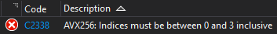
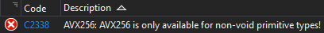
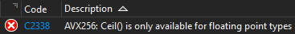

# Contents
- [Overview](https://github.com/tsen-dev/avx256#overview)
- [Quickstart Guide](https://github.com/tsen-dev/avx256#quickstart-guide)
- [Demos](https://github.com/tsen-dev/avx256#demos)
- [Documentation](https://github.com/tsen-dev/avx256#documentation)

 

# Overview

AVX256 is a [SIMD](https://en.wikipedia.org/wiki/Single_instruction,_multiple_data) library that provides an intuitive and readable interface to 256-bit [AVX](https://en.wikipedia.org/wiki/Advanced_Vector_Extensions) and [AVX2](https://en.wikipedia.org/wiki/Advanced_Vector_Extensions#Advanced_Vector_Extensions_2) SIMD instructions using low-cost abstractions.

It provides common SIMD operations, both one-to-one mappings to AVX instructions and operations achieved using sequences of AVX instructions 

It is built on [compiler intrinsics](https://docs.microsoft.com/en-us/cpp/intrinsics/compiler-intrinsics?view=msvc-170), hence takes advantage of register allocation, instruction scheduling, and other compiler optimisations for the best performance and integration with surrounding code.

This library requires C++17 or above due to its use of  `if constexpr (...)` for conditional compilation

 

# Quickstart Guide
1. Identify whether your CPU supports AVX2 instructions. This can be done in one of two ways:
    1. Check your CPU model's page on the manufacturer's site
    2. Call the `bool AVX256Utils::HasAVX2Support(void)` function
        - As this is a [MASM](https://en.wikipedia.org/wiki/Microsoft_Macro_Assembler) function, it is defined separately in the `avx256utils_asm.asm` file
        - In Visual Studio, this file can be included in your build process by `right clicking your project > Build Dependencies > Build Customisations... > masm` (must be done before any MASM files are imported into the project)
    
 

2. Create an AVX256 object:
    - An `AVX256<T>` object points to a contiguous 256-bit (32 bytes) of `T` data, the starting address of which is stored in its `T* Data` attribute
    - An AVX256 object can be created in one of four ways:
        1. `AVX256<T>{};`: Allocates 32-bytes of `T` memory (e.g. 32 chars or 8 for floats, etc) and sets its `Data` to point to it. The allocated memory is de-allocated during destruction
        2. `AVX256<T>{dataPtr};`: Sets its `Data` to point to the `T* dataPtr`. No de-allocation is performed during destruction since the data is not 'owned' by the object 
        3. `AVX256<T>{array}`: Allocates 32-bytes of memory for the specified type `T` (e.g. 32 chars or, 8 floats, etc) and sets its `Data` to point to it. The data from `std::array<T, 32 / sizeof(T)> array` is then copied into AVX256's own memory via 256-bit AVX move instructions. The allocated memory is de-allocated during destruction
            - This constructor can also be used with initialiser lists, e.g. `AVX256<double>{{1.0, 2.0, 3.0, 4.0}};`
        4. `AVX256<T>{avx}`: Allocates 32-bytes of memory for the specified type `T` (e.g. 32 chars or, 8 floats, etc) and sets its `Data` to point to it. The data pointed to by `AVX256<T> avx` is then copied into AVX256's own memory via 256-bit AVX move instructions. The allocated memory is de-allocated during destruction
    
 

3. Call the AVX256 object's methods:
    - An AVX256 object exposes SIMD operations via its methods. There are four types of operations:
        1. Destructive operations (i.e. ones that overwrite the AVX256 object's `Data`) return a reference to the AVX256 object, allowing chained method calls. E.g. `avx1.Clear().Negate().Sub(avx2);`
           - These operations can also be called via assignment operators, e.g. `avx1 += avx2` (addition assignment) is equivalent to `avx1.Add(avx2)` 
        2. Non-destructive operations return their result in an `std::array`. E.g. `avx1.LessThan(avx2)` returns a mask array
           - These operations can also be called via their operators, e.g. `avx1 < avx2` is equivalent to `avx1.IsLessThan(avx2)` 
        3. Methods that return a single value. E.g. `avx1.IsZero()` or `avx1.Sum()`
        4. Methods that return no values. E.g. `avx1.Next()` or `avx1.Previous()`
    - See the [documentation](https://github.com/tsen-dev/avx256#documentation) below for all available operations
    
 

4. The items of an AVX256 object can be accessed via the subscript operator (e.g. `avx[15]`), and can be written to an `std::ostream` via the `<<` operator (e.g. `std::cout << AVX256<uint64_t>{{1, 2, 3, 4}}` prints `|1|2|3|4|`)
    
 

5. The AVX256 library also features custom compilation errors, which provide more insight than standard template errors. E.g:
    - <code>AVX256<uint64_t> avx{ {10, 20, 30, 40} }; 
      avx.Permute64<4, 2, 1, 0>(); // Attempt to reverse order of elements, but the first order index is mistakenly set to 4 (out-of-bounds) instead of 3 
      </code>
        - Compilation output: `avx256.h(1125,105): error C2338: AVX256: Indices must be between 0 and 3 inclusive` 
    - <code>class X { public: uint8_t x[32]; }; 
	AVX256<X> avx{}; // Attempt to create an AVX256 with an unsupported type 
      </code>
        - Compilation output: `avx256.h(21,41): error C2338: AVX256: AVX256 is only available for non-void primitive types!` 
    - <code>AVX256<uint64_t> avx{ {10, 20, 30, 40} }; 
	avx.Ceil(); // Attempt to use a function that isn't available for that type 
      </code>
        - Compilation output: `avx256.h(895,42): error C2338: AVX256: Ceil() is only available for floating point types` 

 

# Demos

Scalar: 

<pre><code>for (uint64_t i = 0; i < size; ++i)
  image1.data[i] = (image1.data[i] + image2.data[i] + 1) >> 1;

movd        xmm2,dword ptr [rcx+r9]  
xorps       xmm0,xmm0  
punpcklbw   xmm2,xmm0  
punpcklwd   xmm2,xmm0  
movd        xmm1,dword ptr [rbx+r9]  
punpcklbw   xmm1,xmm0  
punpcklwd   xmm1,xmm0  
paddd       xmm2,xmm1  
paddd       xmm2,xmm3  
psrad       xmm2,xmm4  
pshuflw     xmm0,xmm2,0D8h  
pshufhw     xmm1,xmm0,0D8h  
xorps       xmm0,xmm0  
pshufd      xmm2,xmm1,0D8h  
pand        xmm2,xmmword ptr [__xmm@00ff00ff00ff00ff00ff00ff00ff00ff]  
packuswb    xmm2,xmm2  
movd        dword ptr [rcx+r9],xmm2 ; Save result  
; The loop body ends here, but is unrolled to include three more iterations

; Iteration 2 start
movd        xmm1,dword ptr [rcx+r9+4]  
movd        xmm2,dword ptr [rbx+r9+4]
; Only 4 bytes (32-bits) are processed per iteration

;... 3 more iterations ... 

add         r9,10h  
cmp         r9,rax  
jb          blendScalar+0E0h
</code></pre>
  1. Used 128-bit SSE instructions instead of 256-bit AVX
  2. Failed to use the dedicated averaging instruction (PAVGB), creating more verbose code:
      - Each byte had to be extended into a dword (32-bits) to ensure the intermediate addition doesn't overflow (even though bytes only really need to be extended into words (16-bits))
      - This is why only 4 bytes can be processed per iteration (32 * 4 = 128) instead of 8 (16 * 8 = 128) 
  
<pre><code>for (int i = 0; i < count; ++i, avxImage1.Next(), avxImage2.Next())
  avxImage1.Average(avxImage2);

test        r9,r9  
je          blendDemo+5C2h 
nop  
vmovdqu     ymm1,ymmword ptr [rdx]  
vpavgb      ymm1,ymm1,ymmword ptr [rcx]  
vmovdqu     ymmword ptr [rcx],ymm1  
inc         r8d  
lea         rcx,[rcx+20h]  
lea         rdx,[rdx+20h]  
movsxd      rax,r8d  
cmp         rax,r9  
jb          blendDemo+5A0h
</code></pre>
  
  - 32 bytes (256-bits) are processed per iteration

Scalar:

<pre><code>for (uint64_t i = 0; i < size; ++i)
  image.data[i] = (image.data[i] > boundary) * UINT8_MAX;

test        r8,r8  
je          thresholdDemo+5C8h  
nop         dword ptr [rax]  
nop         word ptr [rax+rax]  
mov         rcx,qword ptr [rbp+310h]  
cmp         dil,byte ptr [rcx+rdx]  
sbb         al,al  
mov         byte ptr [rcx+rdx],al  
inc         rdx  
cmp         rdx,r8  
jb          thresholdDemo+5B0h
</code></pre>

  - Failed to vectorise

AVX256:

<pre><code>for (int i = 0; i < count; ++i, avxImage.Next())
  avxImage = avxImage > avxBoundary;

test        rdx,rdx  
je          thresholdAVX256+0EFh  
vmovdqu     ymm3,ymmword ptr [__ymm@8080808080808080808080808080808080808080808080808080808080808080]  
nop         word ptr [rax+rax]

; Convert unsigned numbers to signed since the AVX comparison instruction is signed 
vpxor       ymm2,ymm3,ymmword ptr [r15]  
vpxor       ymm1,ymm3,ymmword ptr [rdi]

vpcmpgtb    ymm2,ymm1,ymm2  
vmovdqu     ymmword ptr [rdi],ymm2
inc         ecx  
lea         rdi,[rdi+20h]  
movsxd      rax,ecx  
cmp         rax,rdx  
jb          thresholdAVX256+0D0h
</code></pre>

<pre><code>for (uint64_t i = 0; i < size; ++i)
  mask.data[i] = abs(currentFrame.data[i] - previousFrame.data[i]);

00007FF6A8E651D0 66 43 0F 6E 04 06    movd        xmm0,dword ptr [r14+r8]  
00007FF6A8E651D6 66 43 0F 6E 0C 07    movd        xmm1,dword ptr [r15+r8]  
00007FF6A8E651DC 66 0F 38 31 D0       pmovzxbd    xmm2,xmm0  
00007FF6A8E651E1 66 0F 38 31 C1       pmovzxbd    xmm0,xmm1  
00007FF6A8E651E6 66 0F FA D0          psubd       xmm2,xmm0  
00007FF6A8E651EA 66 0F 38 1E C2       pabsd       xmm0,xmm2  
00007FF6A8E651EF F2 0F 70 C8 D8       pshuflw     xmm1,xmm0,0D8h  
00007FF6A8E651F4 66 43 0F 6E 44 06 04 movd        xmm0,dword ptr [r14+r8+4]  
00007FF6A8E651FB F3 0F 70 D1 D8       pshufhw     xmm2,xmm1,0D8h  
00007FF6A8E65200 66 43 0F 6E 4C 07 04 movd        xmm1,dword ptr [r15+r8+4]  
00007FF6A8E65207 66 0F 70 DA D8       pshufd      xmm3,xmm2,0D8h  
00007FF6A8E6520C 66 0F DB 1D 0C 44 00 00 pand        xmm3,xmmword ptr [__xmm@00ff00ff00ff00ff00ff00ff00ff00ff (07FF6A8E69620h)]  
00007FF6A8E65214 66 0F 67 DB          packuswb    xmm3,xmm3  
00007FF6A8E65218 66 42 0F 7E 1C 01    movd        dword ptr [rcx+r8],xmm3  
00007FF6A8E6521E 66 0F 38 31 D0       pmovzxbd    xmm2,xmm0  
00007FF6A8E65223 66 0F 38 31 C1       pmovzxbd    xmm0,xmm1  
00007FF6A8E65228 66 0F FA D0          psubd       xmm2,xmm0  
00007FF6A8E6522C 66 0F 38 1E C2       pabsd       xmm0,xmm2  
00007FF6A8E65231 F2 0F 70 C8 D8       pshuflw     xmm1,xmm0,0D8h  
00007FF6A8E65236 66 43 0F 6E 44 06 08 movd        xmm0,dword ptr [r14+r8+8]  
00007FF6A8E6523D F3 0F 70 D1 D8       pshufhw     xmm2,xmm1,0D8h  
00007FF6A8E65242 66 43 0F 6E 4C 07 08 movd        xmm1,dword ptr [r15+r8+8]  
00007FF6A8E65249 66 0F 70 DA D8       pshufd      xmm3,xmm2,0D8h  
00007FF6A8E6524E 66 0F DB 1D CA 43 00 00 pand        xmm3,xmmword ptr [__xmm@00ff00ff00ff00ff00ff00ff00ff00ff (07FF6A8E69620h)]  
00007FF6A8E65256 66 0F 67 DB          packuswb    xmm3,xmm3  
00007FF6A8E6525A 66 42 0F 7E 5C 01 04 movd        dword ptr [rcx+r8+4],xmm3  
00007FF6A8E65261 66 0F 38 31 D0       pmovzxbd    xmm2,xmm0  
00007FF6A8E65266 66 0F 38 31 C1       pmovzxbd    xmm0,xmm1  
00007FF6A8E6526B 66 0F FA D0          psubd       xmm2,xmm0  
00007FF6A8E6526F 66 0F 38 1E C2       pabsd       xmm0,xmm2  
00007FF6A8E65274 F2 0F 70 C8 D8       pshuflw     xmm1,xmm0,0D8h  
00007FF6A8E65279 66 43 0F 6E 44 06 0C movd        xmm0,dword ptr [r14+r8+0Ch]  
00007FF6A8E65280 F3 0F 70 D1 D8       pshufhw     xmm2,xmm1,0D8h  
00007FF6A8E65285 66 43 0F 6E 4C 07 0C movd        xmm1,dword ptr [r15+r8+0Ch]  
00007FF6A8E6528C 66 0F 70 DA D8       pshufd      xmm3,xmm2,0D8h  
00007FF6A8E65291 66 0F DB 1D 87 43 00 00 pand        xmm3,xmmword ptr [__xmm@00ff00ff00ff00ff00ff00ff00ff00ff (07FF6A8E69620h)]  
00007FF6A8E65299 66 0F 67 DB          packuswb    xmm3,xmm3  
00007FF6A8E6529D 66 42 0F 7E 5C 01 08 movd        dword ptr [rcx+r8+8],xmm3  
00007FF6A8E652A4 66 0F 38 31 D0       pmovzxbd    xmm2,xmm0  
00007FF6A8E652A9 66 0F 38 31 C1       pmovzxbd    xmm0,xmm1  
00007FF6A8E652AE 66 0F FA D0          psubd       xmm2,xmm0  
00007FF6A8E652B2 66 0F 38 1E C2       pabsd       xmm0,xmm2  
00007FF6A8E652B7 F2 0F 70 C8 D8       pshuflw     xmm1,xmm0,0D8h  
00007FF6A8E652BC F3 0F 70 D1 D8       pshufhw     xmm2,xmm1,0D8h  
00007FF6A8E652C1 66 0F 70 DA D8       pshufd      xmm3,xmm2,0D8h  
00007FF6A8E652C6 66 0F DB 1D 52 43 00 00 pand        xmm3,xmmword ptr [__xmm@00ff00ff00ff00ff00ff00ff00ff00ff (07FF6A8E69620h)]  
00007FF6A8E652CE 66 0F 67 DB          packuswb    xmm3,xmm3  
00007FF6A8E652D2 66 42 0F 7E 5C 01 0C movd        dword ptr [rcx+r8+0Ch],xmm3  
00007FF6A8E652D9 49 83 C0 10          add         r8,10h  
00007FF6A8E652DD 4C 3B C0             cmp         r8,rax  
00007FF6A8E652E0 0F 82 EA FE FF FF    jb          absDiffScalar+110h (07FF6A8E651D0h)  
</code></pre>

[comment]: <> (![Demo_4]&#40;readme_animations/bgr_to_rgb_demo.gif&#41;)

 

# Documentation

- [Construction](https://github.com/tsen-dev/avx256#construction)
- [Destruction](https://github.com/tsen-dev/avx256#destruction)
- [Assignment](https://github.com/tsen-dev/avx256#assignment)
- [Arithmetic](https://github.com/tsen-dev/avx256#arithmetic)
- [Math](https://github.com/tsen-dev/avx256#math)
- [Bitwise](https://github.com/tsen-dev/avx256#bitwise)
- [Comparison](https://github.com/tsen-dev/avx256#comparison)
- [Shift](https://github.com/tsen-dev/avx256#shift)
- [Permute](https://github.com/tsen-dev/avx256#permute)
- [Utility](https://github.com/tsen-dev/avx256#utility)

 

### Construction
- `AVX256()`: Create an AVX256 that points to a newly allocated 32-bytes
- `AVX256(T* const data)`: Create an AVX256 that points to the specified data
- `AVX256(const std::array<T, 32 / sizeof(T)>& data)`: Create an AVX256 that points to a newly allocated 32-bytes which has the specified array copied into it.
- `AVX256(const AVX256& avx)`: Create an AVX256 that points to a newly allocated 32-bytes which has the specified AVX256's data copied into it.

 

### Destruction
- `~AVX256()`: De-allocate the pointed memory if it was newly allocated during construction 

 

### Assignment

- #### Set (broadcast)
  <ul>Broadcast the specified value into all elements of the AVX256</ul> 
  
    - `AVX256& Set(const T value)`: Broadcasts the specified value into all elements of the AVX256
    
    #### = operator
    - `AVX256& operator=(const T value)`
    

- #### Set (variable)
    <ul>Copy the specified data into AVX256's data</ul>   

    - `AVX256& Set(const T* values)`: Copy the specified data into AVX256's data
    - `AVX256& Set(const std::array<T, 32 / sizeof(T)>& values)`: Copy the specified data into AVX256's data 
    - `AVX256& Set(const AVX256& values)`: Copy the specified data into AVX256's data
    
    #### = operator
    - `AVX256& operator=(const T* values)`
    - `AVX256& operator=(const std::array<T, 32 / sizeof(T)>& values)` 
    - `AVX256& operator=(const AVX256& values)`

 
    
### Arithmetic

- #### Addition
  <ul>Add the elements of the operand to the corresponding elements  of the AVX256 object.
   Write the result in the AVX256 object's data</ul> 
  
    - `AVX256& Add(const T* operand)`
    - `AVX256& Add(const std::array<T, 32 / sizeof(T)>& operand)`
    - `AVX256& Add(const AVX256& operand)`
    
  #### Saturating Addition 
  <ul>Available for 8 and 16-bit integers only</ul> 
  
    - `AVX256& AddSaturate(const T* operand)`
    - `AVX256& AddSaturate(const std::array<T, 32 / sizeof(T)>& operand)`
    - `AVX256& AddSaturate(const AVX256& operand)`
    
    #### += operator 
    <ul>Perform saturation arithmetic for 8 and 16-bit integers, wraparound arithmetic otherwise</ul> 
  
    - `AVX256& operator+=(const T* operand)`
    - `AVX256& operator+=(const std::array<T, 32 / sizeof(T)>& operand)`
    - `AVX256& operator+=(const AVX256& operand)`

    #### + operator
    <ul>Perform saturation arithmetic for 8 and 16-bit integers, wraparound arithmetic otherwise. 
    Return the result in an <code>std::array</code></ul> 

    - `std::array<T, 32 / sizeof(T)> operator+(const T* operand)`
    - `std::array<T, 32 / sizeof(T)> operator+(const std::array<T, 32 / sizeof(T)>& operand)`
    - `std::array<T, 32 / sizeof(T)> operator+(const AVX256& operand)`
    
    
- #### Subtraction
  <ul>Subtract the elements of the operand from the corresponding elements  of the AVX256 object.
   Write the result in the AVX256 object's data</ul>   

    - `AVX256& Sub(const T* operand)`
    - `AVX256& Sub(const std::array<T, 32 / sizeof(T)>& operand)`
    - `AVX256& Sub(const AVX256& operand)`
    
  #### Saturating Subtraction 
  <ul>Available for 8 and 16-bit integers only</ul> 
  
    - `AVX256& SubSaturate(const T* operand)`
    - `AVX256& SubSaturate(const std::array<T, 32 / sizeof(T)>& operand)`
    - `AVX256& SubSaturate(const AVX256& operand)`
    
    #### -= operator 
    <ul>Perform saturation arithmetic for 8 and 16-bit integers, wraparound arithmetic otherwise</ul> 
  
    - `AVX256& operator-=(const T* operand)`
    - `AVX256& operator-=(const std::array<T, 32 / sizeof(T)>& operand)`
    - `AVX256& operator-=(const AVX256& operand)`

    #### - operator
    <ul>Perform saturation arithmetic for 8 and 16-bit integers, wraparound arithmetic otherwise. 
    Return the result in an <code>std::array</code></ul>   

    - `std::array<T, 32 / sizeof(T)> operator-(const T* operand)`
    - `std::array<T, 32 / sizeof(T)> operator-(const std::array<T, 32 / sizeof(T)>& operand)`
    - `std::array<T, 32 / sizeof(T)> operator-(const AVX256& operand)`

- #### Multiplication
  <ul>
  Multiply the elements of the operand by the corresponding elements of the AVX256 object.
   Write the result in the AVX256 object's data  
  
  64-bit (floating-point): Full-width multiplication 
   64-bit (integer): The low 32-bits of each element are multiplied, the 64-bit result is saved
   32-bit (integer): 32-bits are multiplied, the low 32-bits of the result is saved
   16-bit: 16-bits are multiplied, the low 16-bits of the result is saved
   8-bit: 8-bits are multiplied, the low 8-bits of the result is saturated and saved
  </ul>
  
    - `AVX256& Mul(const T* operand)`
    - `AVX256& Mul(const std::array<T, 32 / sizeof(T)>& operand)`
    - `AVX256& Mul(const AVX256& operand)`
    
    #### *= operator
    - `AVX256& operator*=(const T* operand)`
    - `AVX256& operator*=(const std::array<T, 32 / sizeof(T)>& operand)`
    - `AVX256& operator*=(const AVX256& operand)`

    #### * operator
    <ul>Return the result in an <code>std::array</code></ul> 
  
    - `std::array<T, 32 / sizeof(T)> operator*(const T* operand)`
    - `std::array<T, 32 / sizeof(T)> operator*(const std::array<T, 32 / sizeof(T)>& operand)`
    - `std::array<T, 32 / sizeof(T)> operator*(const AVX256& operand)`

    
- #### Division
  <ul>
  Divide the elements of the AVX256 object by the corresponding elements of the operand.
   Write the result in the AVX256 object's data  
  Available for double and float only</ul> 
  
    - `AVX256& Div(const T* operand)`
    - `AVX256& Div(const std::array<T, 32 / sizeof(T)>& operand)`
    - `AVX256& Div(const AVX256& operand)`
    
    #### /= operator
    - `AVX256& operator/=(const T* operand)`
    - `AVX256& operator/=(const std::array<T, 32 / sizeof(T)>& operand)`
    - `AVX256& operator/=(const AVX256& operand)`

    #### / operator
    <ul>Return the result in an <code>std::array</code></ul> 
  
    - `std::array<T, 32 / sizeof(T)> operator/(const T* operand)`
    - `std::array<T, 32 / sizeof(T)> operator/(const std::array<T, 32 / sizeof(T)>& operand)`
    - `std::array<T, 32 / sizeof(T)> operator/(const AVX256& operand)`
    
 

### Math

- #### Absolute
  <ul>Overwrite each AVX256 element with its absolute value.  
  Available for 8, 16, and 32-bit signed integers only
  </ul> 

    - `AVX256& Absolute()`
    

- #### AbsoluteDifference
  <ul>Overwrite each AVX256 element <code>avx[i]</code> with <code>abs(avx[i] - operand[i])</code>  
  This function is not available for signed (and 64-bit unsigned) integers
  </ul> 

    - `AVX256& AbsoluteDifference(const T* operand)`
    - `AVX256& AbsoluteDifference(const std::array<T, 32 / sizeof(T)>& operand)`
    - `AVX256& AbsoluteDifference(const AVX256& operand)`

- #### Min
  <ul>Overwrite each AVX256 element <code>avx[i]</code> with <code>min(avx[i], operand[i])</code>  
  This function is not available for 64-bit integers
  </ul> 

    - `AVX256& Min(const T* operand)`
    - `AVX256& Min(const std::array<T, 32 / sizeof(T)>& operand)`
    - `AVX256& Min(const AVX256& operand)`
    

- #### Max
  <ul>Overwrite each AVX256 element <code>avx[i]</code> with <code>max(avx[i], operand[i])</code>  
  This function is not available for 64-bit integers
  </ul> 

    - `AVX256& Max(const T* operand)`
    - `AVX256& Max(const std::array<T, 32 / sizeof(T)>& operand)`
    - `AVX256& Max(const AVX256& operand)`
    

- #### Floor
  <ul>Overwrite each AVX256 element <code>avx[i]</code> with <code>floor(avx[i])</code>  
  Available for double and float only
  </ul> 

    - `AVX256& Floor()`
    

- #### Ceil
  <ul>Overwrite each AVX256 element <code>avx[i]</code> with <code>ceil(avx[i])</code>  
  Available for double and float only
  </ul> 

    - `AVX256& Ceil()`
    

- #### Sum
  <ul>Return the sum of all packed elements. 
  The result is returned in full precision except with 32-bit integers, whose sum is accumulated into 32-bits and hence can overflow.  
  This function is not available for 64-bit integers</ul> 

    - `auto Sum()` 

- #### Average
  <ul>Overwrite each AVX256 element <code>avx[i]</code> with <code>(avx[i] + operand[i]) / 2)</code> 
  Fractional results are rounded up to the nearest integer  
  Available for 8 and 16-bit integers only
  </ul> 

    - `AVX256& Average(const T* operand)`
    - `AVX256& Average(const std::array<T, 32 / sizeof(T)>& operand)`
    - `AVX256& Average(const AVX256& operand)`

- #### Sqrt
    <ul>Overwrite each AVX256 element <code>avx[i]</code> with its square root <code>sqrt(avx[i])</code>  
    Available for double and float only
    </ul> 

    - `AVX256& Sqrt()`
    
- #### Inverse
    <ul>Overwrite each AVX256 element <code>avx[i]</code> with its reciprocal <code>1 / avx[i]</code> (max relative error < 1.5*2^-12)  
    Available for float only
    </ul> 

    - `AVX256& Inverse()`
    

- #### InverseSqrt
    <ul>Overwrite each AVX256 element <code>avx[i]</code> with its inverse square root <code>1 / sqrt(avx[i])</code> (max relative error < 1.5*2^-12)  
    Available for float only
    </ul> 

    - `AVX256& InverseSqrt()`
    
 

### Bitwise

- #### Negate
  <ul>Invert all bits of the AVX256's data.
   Write the result in the AVX256's data</ul> 

    - `AVX256& Negate()`
    
    #### ~ operator
    <ul>Return the result in an <code>std::array</code></ul> 
    
    - `std::array<T, 32 / sizeof(T)> operator~()`
    
- #### And
  <ul>Bitwise AND the 256 bits of the AVX256 with the 256-bits of the operand.
   Write the result in the AVX256's data</ul> 
  
    - `AVX256& And(const T* operand)`
    - `AVX256& And(const std::array<T, 32 / sizeof(T)>& operand)`
    - `AVX256& And(const AVX256& operand)`

    #### &= operator
    - `AVX256& operator&=(const T* operand)`
    - `AVX256& operator&=(const std::array<T, 32 / sizeof(T)>& operand)`
    - `AVX256& operator&=(const AVX256& operand)`
    
    #### & operator
    <ul>Return the result in an <code>std::array</code></ul> 

    - `std::array<T, 32 / sizeof(T)> operator&(const T* operand)`
    - `std::array<T, 32 / sizeof(T)> operator&(const std::array<T, 32 / sizeof(T)>& operand)`
    - `std::array<T, 32 / sizeof(T)> operator&(const AVX256& operand)`
    
- #### Or
  <ul>Bitwise OR the 256 bits of the AVX256 with the 256-bits of the operand.
   Write the result in the AVX256's data</ul> 
  
    - `AVX256& Or(const T* operand)`
    - `AVX256& Or(const std::array<T, 32 / sizeof(T)>& operand)`
    - `AVX256& Or(const AVX256& operand)`

    #### |= operator
    - `AVX256& operator|=(const T* operand)`
    - `AVX256& operator|=(const std::array<T, 32 / sizeof(T)>& operand)`
    - `AVX256& operator|=(const AVX256& operand)`
    
    #### | operator
    <ul>Return the result in an <code>std::array</code></ul> 

    - `std::array<T, 32 / sizeof(T)> operator|(const T* operand)`
    - `std::array<T, 32 / sizeof(T)> operator|(const std::array<T, 32 / sizeof(T)>& operand)`
    - `std::array<T, 32 / sizeof(T)> operator|(const AVX256& operand)`
    
- #### Xor
  <ul>Bitwise XOR the 256 bits of the AVX256 with the 256-bits of the operand.
   Write the result in the AVX256's data</ul> 
  
    - `AVX256& Xor(const T* operand)`
    - `AVX256& Xor(const std::array<T, 32 / sizeof(T)>& operand)`
    - `AVX256& Xor(const AVX256& operand)`

    #### ^= operator
    - `AVX256& operator^=(const T* operand)`
    - `AVX256& operator^=(const std::array<T, 32 / sizeof(T)>& operand)`
    - `AVX256& operator^=(const AVX256& operand)`
    
    #### ^ operator
    <ul>Return the result in an <code>std::array</code></ul> 

    - `std::array<T, 32 / sizeof(T)> operator^(const T* operand)`
    - `std::array<T, 32 / sizeof(T)> operator^(const std::array<T, 32 / sizeof(T)>& operand)`
    - `std::array<T, 32 / sizeof(T)> operator^(const AVX256& operand)`

 

### Comparison

- #### IsEqualTo
    <ul>Returns a condition mask where each element whose corresponding condition evaluated to true is set to all 1's, otherwise to all 0's (i.e. <code>mask[i] = avx[i] == operand[i] ? (2 ^ (8 * sizeof(T))) - 1 : 0</code>) 
    Floating-point comparisons are unordered and non-signaling
  </ul> 

    - `std::array<T, 32 / sizeof(T)> IsEqualTo(const T* values)`
    - `std::array<T, 32 / sizeof(T)> IsEqualTo(const std::array<T, 32 / sizeof(T)>& values)`
    - `std::array<T, 32 / sizeof(T)> IsEqualTo(const AVX256& values)`
    
    #### == operator
  
    - `std::array<T, 32 / sizeof(T)> operator==(const T* values)`
    - `std::array<T, 32 / sizeof(T)> operator==(const std::array<T, 32 / sizeof(T)>& values)`
    - `std::array<T, 32 / sizeof(T)> operator==(const AVX256& values)`
    
- #### IsGreaterThan
    <ul>Returns a condition mask where each element whose corresponding condition evaluated to true is set to all 1's, otherwise to all 0's (i.e. <code>mask[i] = avx[i] > operand[i] ? (2 ^ (8 * sizeof(T))) - 1 : 0</code>) 
    Floating-point comparisons are unordered and non-signaling
  </ul> 

    - `std::array<T, 32 / sizeof(T)> IsGreaterThan(const T* values)`
    - `std::array<T, 32 / sizeof(T)> IsGreaterThan(const std::array<T, 32 / sizeof(T)>& values)`
    - `std::array<T, 32 / sizeof(T)> IsGreaterThan(const AVX256& values)`
    
    #### &gt; operator
  
    - `std::array<T, 32 / sizeof(T)> operator>(const T* values)`
    - `std::array<T, 32 / sizeof(T)> operator>(const std::array<T, 32 / sizeof(T)>& values)`
    - `std::array<T, 32 / sizeof(T)> operator>(const AVX256& values)`
    
- #### IsLessThan
    <ul>Returns a condition mask where each element whose corresponding condition evaluated to true is set to all 1's, otherwise to all 0's (i.e. <code>mask[i] = avx[i] < operand[i] ? (2 ^ (8 * sizeof(T))) - 1 : 0</code>) 
    Floating-point comparisons are unordered and non-signaling
  </ul> 

    - `std::array<T, 32 / sizeof(T)> IsLessThan(const T* values)`
    - `std::array<T, 32 / sizeof(T)> IsLessThan(const std::array<T, 32 / sizeof(T)>& values)`
    - `std::array<T, 32 / sizeof(T)> IsLessThan(const AVX256& values)`
    
    #### &lt; operator
  
    - `std::array<T, 32 / sizeof(T)> operator<(const T* values)`
    - `std::array<T, 32 / sizeof(T)> operator<(const std::array<T, 32 / sizeof(T)>& values)`
    - `std::array<T, 32 / sizeof(T)> operator<(const AVX256& values)`
    
 

### Shift

- #### ShiftLeft (constant shift)
    <ul>Perform a logical left shift on each element of the AVX256 by the amount specified by the operand. 
    Write the result in the AVX256's data  
    Available for 16, 32, and 64-bit integers only</ul> 
  
    - `AVX256& ShiftLeft(const int shift)`
    
    #### <<= operator
    - `AVX256& operator<<=(const int shift)`
      
    #### << operator
    <ul>Return the result in an <code>std::array</code></ul> 
  
    - `std::array<T, 32 / sizeof(T)> operator<<(const int shift)`
    

- #### ShiftLeft (variable shift)
    <ul>Perform a logical left shift on each element of the AVX256 by the amount specified by the corresponding element of the operand (i.e. <code>avx[i] = avx[i] << operand[i]</code>). 
    Write the result in the AVX256's data  
    Available for 32 and 64-bit integers only
    </ul> 
  
    - `AVX256& ShiftLeft(const T* shifts)`
    - `AVX256& ShiftLeft(const std::array<T, 32 / sizeof(T)>& shifts)`
    - `AVX256& ShiftLeft(const AVX256& shifts)`
    
    #### <<= operator
    - `AVX256& operator<<=(const T* shifts)`
    - `AVX256& operator<<=(const std::array<T, 32 / sizeof(T)>& shifts)`
    - `AVX256& operator<<=(const AVX256& shifts)`
      
    #### << operator
    <ul>Return the result in an <code>std::array</code></ul> 
  
    - `std::array<T, 32 / sizeof(T)> operator<<(const T* shifts)`
    - `std::array<T, 32 / sizeof(T)> operator<<(const std::array<T, 32 / sizeof(T)>& shifts)`
    - `std::array<T, 32 / sizeof(T)> operator<<(const AVX256& shifts)`

- #### ShiftRight (constant shift)
    <ul>
    Perform a right shift on each element of the AVX256 by the amount specified by the operand. 
    Write the result in the AVX256's data  
  	Signed types (32 and 16-bit integers): Arithmetic shift 
    Unsigned types (64, 32, and 16-bit integers): Logical shift
     </ul> 
  
    - `AVX256& ShiftRight(const int shift)`
    
    #### &gt;&gt;= operator
    - `AVX256& operator>>=(const int shift)`
      
    #### &gt;&gt; operator
    <ul>Return the result in an <code>std::array</code></ul> 
  
    - `std::array<T, 32 / sizeof(T)> operator>>(const int shift)`
    

- #### ShiftRight (variable shift)
    <ul>Perform a right shift on each element of the AVX256 by the amount specified by the corresponding element of the operand (i.e. <code>avx[i] = avx[i] >> operand[i]</code>). 
    Write the result in the AVX256's data  
    Signed types (32): Arithmetic shift 
    Unsigned types (64 and 32-bit integers): Logical shift
    </ul> 
  
    - `AVX256& ShiftRight(const T* shifts)`
    - `AVX256& ShiftRight(const std::array<T, 32 / sizeof(T)>& shifts)`
    - `AVX256& ShiftRight(const AVX256& shifts)`
    
    #### &gt;&gt;= operator
    - `AVX256& operator>>=(const T* shifts)`
    - `AVX256& operator>>=(const std::array<T, 32 / sizeof(T)>& shifts)`
    - `AVX256& operator>>=(const AVX256& shifts)`
      
    #### &gt;&gt; operator
    <ul>Return the result in an <code>std::array</code></ul> 
  
    - `std::array<T, 32 / sizeof(T)> operator>>(const T* shifts)`
    - `std::array<T, 32 / sizeof(T)> operator>>(const std::array<T, 32 / sizeof(T)>& shifts)`
    - `std::array<T, 32 / sizeof(T)> operator>>(const AVX256& shifts)`
    
 

### Permute

- #### Permute64<int d0, int d1, int d2, int d3>
    <ul>Re-order 64-bit elements using the order specified by template arguments (i.e. <code>avx[i] = avx[di]</code>). 
    One element can be copied to many elements, template arguments must have values in the range 0-3 inclusive</ul> 
  
    - `AVX256& Permute64()`

- #### Permute32
    <ul>Re-order 32-bit elements using the order specified by the operand (i.e. <code>avx[i] = avx[order[i]]</code>). 
    One element can be copied to many elements, operand elements should have values in the range 0-7 inclusive</ul> 
  
    - `AVX256& Permute32(const U* order)`
    - `AVX256& Permute32(const std::array<U, 32 / sizeof(U)>& order)`
    - `AVX256& Permute32(const AVX256<U>& order)`
    
- #### Permute8
    <ul>Re-order 8-bit elements within 128-bit lanes using the order specified by the operand. 
    <code>order[0]</code> to <code>order[15]</code> permute <code>avx[0]</code> to <code>avx[15]</code>, while <code>order[16]</code> to <code>order[31]</code> permute <code>avx[16]</code> to <code>avx[31]</code> 
    One element can be copied to many elements.</ul> 

    - `AVX256& Permute8(const U* order)`
    - `AVX256& Permute8(const std::array<U, 32 / sizeof(U)>& order)`
    - `AVX256& Permute8(const AVX256<U>& order)`

 

### Utility
- `AVX256& Clear()`: Set all elements of the AVX256 to zero
- `bool IsZero()`: Returns `true` if all elements are zero, `false` otherwise
- `void Next()`: Increments the AVX256's `Data` to point to the next 32 bytes (or 256 bits). Should only be used if adjacent memory is safe to access.
- `void Previous()`: Decrements the AVX256's `Data` to point to the previous 32 bytes (or 256 bits). Should only be used if adjacent memory is safe to access. 

